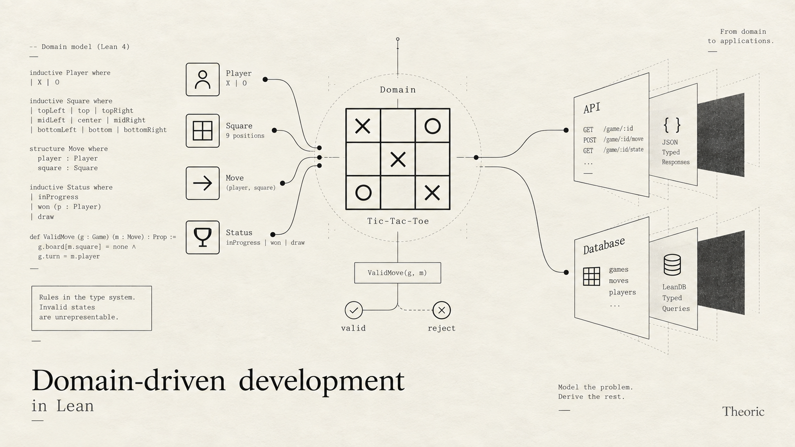

# Introduction to Domain-driven development in Lean: Tic-Tac-Toe

Domain driven development is defining a program purely in the language of its domain, and letting the compiler derive the execution details from it. I'm taking tic-tac-toe as the example because it is small and easy to follow. The post is built on top of libraries, like LeanAPI and LeanDB which I had released earlier.

The main thing to take away is that theorem-proving languages like Lean let you define the domain abstractly and precisely. In pretty much every other language, you end up mixing the what and the how.



## A domain is a vocabulary and its rules

A domain is defined by its grammar: a vocabulary (a set of words with meanings), and the rules of how those words combine. In tic-tac-toe we have:

- Players, of two kinds: X and O.
- A board, which is a grid of nine squares. Each square is empty, or has an X or an O on it.
- A move: a player and a square.
- A game's status: still going with someone to move, or over with a winner or a draw.

In Lean:

```lean
inductive Player where
  | x
  | o
  deriving DecidableEq, Repr

/-- The nine squares of the board. -/
inductive Square where
  | topLeft    | top    | topRight
  | left       | center | right
  | bottomLeft | bottom | bottomRight
  deriving DecidableEq, Repr

structure Move where
  player : Player
  square : Square
  deriving DecidableEq, Repr
```


A game is in one of five states:

```lean
inductive Status where
  | xToMove | oToMove       -- still going
  | xWon | oWon | draw      -- over
  deriving DecidableEq, Repr
```

The board is defined by list of, valid, moves made so far, in order:

```lean
/-- The marks on the board, in the order they were made. -/
structure Board where
  private mk ::
  moves : List Move

def Board.empty : Board := ⟨[]⟩

/-- Who has marked a square, if anyone. -/
def Board.mark (board : Board) (square : Square) : Option Player :=
  (board.moves.find? (·.square == square)).map (·.player)
```

`Option Player` is the three states of a square: `none` is empty, `some .x` and `some .o` are the marks.

Whose turn it is and who won are not stored anywhere. They're computed from the board:

```lean
/-- The eight ways to win: three rows, three columns, two diagonals. -/
def lines : List (List Square) := [
  [.topLeft, .top, .topRight], [.left, .center, .right], [.bottomLeft, .bottom, .bottomRight],
  [.topLeft, .left, .bottomLeft], [.top, .center, .bottom], [.topRight, .right, .bottomRight],
  [.topLeft, .center, .bottomRight], [.topRight, .center, .bottomLeft]
]

def Board.winner (board : Board) : Option Player :=
  [Player.x, .o].find? fun p => lines.any fun line => line.all (board.mark · == some p)

def Board.status (board : Board) : Status :=
  match board.winner with
  | some .x => .xWon
  | some .o => .oWon
  | none =>
    if board.moves.length = 9 then .draw
    else if board.moves.length % 2 = 0 then .xToMove
    else .oToMove
```

## The rules

A Move is valid if:
- the game is in progress. 
- and the square is empty.
- it's the mover's turn

```lean
/-- The status in which it's this player's move. -/
def Player.toMove : Player → Status
  | .x => .xToMove
  | .o => .oToMove

/-- A move is valid when it's the mover's turn (so the game isn't over) and the square is empty. -/
abbrev Board.ValidMove (board : Board) (move : Move) : Prop :=
  board.status = move.player.toMove ∧ board.mark move.square = none

/-- The only way to put a mark on a board. -/
def Board.play (board : Board) (move : Move) (_ : board.ValidMove move) : Board :=
  ⟨board.moves ++ [move]⟩
```
`(_ : board.ValidMove move)` that you are seeing above in Board.play is unique to Lean, it's a "Proposition" on the move, and the compiler won't execute the function Board.play if move is not valid. And there is no way for the game to in an illegal state.


## Playing over the network

Now we have defined the game, but you can't really play it yet. For that, other parties need to be able to reach it. Let's put a REST API in front of it with [LeanAPI](https://github.com/theoriclabs/leanapi), and keep the games in a database with [LeanDB](/blog/leandb_a_strongly_typed_sql_frontend/).

Using REST semantics:

- `POST /games` starts a game, and returns its id.
- `POST /games/:game/moves` makes a move. The body is a player and a square.
- `GET /games/:game` shows the board and the status.

There's no `PUT` and no `DELETE`. The domain has no way to edit a game or take back a move, so there's nothing for them to do.

### What's stored

A game is a board, so that's what the database stores:

```lean
import LeanDb.Model
import LeanApi.Core
import TicTacToe.Rules
open LeanDb.Model LeanApi.Core TicTacToe

deriving instance Domain for Player, Square, Move, Status

/-- A board is stored and sent as its moves, and read back by replaying them. -/
represent Board as List Move by (·.moves) checked Board.replay

structure Game where
  board : Board
  deriving Entity
```

`LeanDb.Model` is the data model: entities, `represent`, the generated storage steps. `LeanApi.Core` is the operations and endpoints.

The rules file doesn't know about JSON or tables. The server opts the rules' types in: `deriving instance Domain` for the plain types, and `represent` for `Board`.

The table, the column and the JSON are derived from that:

```sh
$ sqlite3 tictactoe.sqlite '.schema game'
CREATE TABLE IF NOT EXISTS "game" (id INTEGER PRIMARY KEY AUTOINCREMENT, "board" TEXT NOT NULL);
$ sqlite3 tictactoe.sqlite 'SELECT board FROM game WHERE id = 1'
[{"player":"x","square":"center"},{"player":"o","square":"topLeft"},{"player":"x","square":"top"},{"player":"o","square":"left"},{"player":"x","square":"bottom"}]
```

The board is stored as its moves, in order. Whose turn it is and who won are still derived, never stored.

### Making a move

```lean
def newGame : Op Empty (Ref Game) :=
  Game.insert { board := .empty }

inductive MoveError where
  | noSuchGame
  | gameOver
  | notYourTurn
  | squareTaken
```

Even though an illegal move cannot be represented in the board, a client can still send a request with an illegal move, so we want to return the appropriate response with the appropriate error message.


```lean

/-- Which part of the rule a move breaks. It only picks the error; `require` does the checking. -/
def MoveError.of (board : Board) (move : Move) : MoveError :=
  if board.status ∈ [.xWon, .oWon, .draw] then .gameOver
  else if board.status ≠ move.player.toMove then .notYourTurn
  else .squareTaken

def move (game : Ref Game) (player : Player) (square : Square) : Op MoveError Status := do
  let some g ← Game.find game | throw .noSuchGame
  let m : Move := ⟨player, square⟩ 
  let ⟨valid⟩ ← require (g.board.ValidMove m) (MoveError.of g.board m) 
  let board := g.board.play m valid
  Game.update g { board }
  return board.status
```

How it works:
- Find the game, `Game.find` searches for the game in the Games table, and throw `.noSuchGame` if the game doesn't exist.
- `let m : Move := ⟨player, square⟩`, `m` packs `(player, square)` in the structure
- `let ⟨valid⟩ ← require (g.board.ValidMove m) (MoveError.of g.board m)` build a proof on runtime that move is valid, and throws a MoveError with 422 status code.
- `let board := g.board.play m valid` creates a new board with the move, and we also pass a proof that the move is valid, then in the next line, we update the database with the updated board.

### The API

`getGame` returns the board and its status:

```lean
structure GameView where
  board  : Board
  status : Status

inductive GetGameError where
  | noSuchGame

def getGame (game : Ref Game) : ReadOp GetGameError GameView := do
  let some g ← Game.find game | throw .noSuchGame
  return { board := g.board, status := g.board.status }
```

Then the API is the list of endpoints:

```lean
def api : Api := [
  post "/games"              newGame,
  post "/games/:game/moves"  move,
  get  "/games/:game"        getGame
]
```

### Running it

The server's entry point is three lines:

```lean
app% server where
  api := api

def main (args : List String) : IO UInt32 :=
  server.main args { database := "tictactoe.sqlite" }
```

`lake exe tictactoe` serves the API on port 8080. Here's a game, run against a fresh database:

```sh
$ curl -X POST localhost:8080/games
{"ok":1}
$ curl -X POST localhost:8080/games/1/moves -d '{"player":"x","square":"center"}'
{"ok":"oToMove"}
$ curl -X POST localhost:8080/games/1/moves -d '{"player":"o","square":"center"}'
{"error":"squareTaken"}
$ curl -X POST localhost:8080/games/1/moves -d '{"player":"x","square":"topLeft"}'
{"error":"notYourTurn"}
$ curl -X POST localhost:8080/games/1/moves -d '{"player":"o","square":"topLeft"}'
{"ok":"xToMove"}
$ curl -X POST localhost:8080/games/1/moves -d '{"player":"x","square":"top"}'
{"ok":"oToMove"}
$ curl -X POST localhost:8080/games/1/moves -d '{"player":"o","square":"left"}'
{"ok":"xToMove"}
$ curl -X POST localhost:8080/games/1/moves -d '{"player":"x","square":"bottom"}'
{"ok":"xWon"}
$ curl -X POST localhost:8080/games/1/moves -d '{"player":"o","square":"right"}'
{"error":"gameOver"}
$ curl localhost:8080/games/1
{"ok":{"board":[{"player":"x","square":"center"},{"player":"o","square":"topLeft"},{"player":"x","square":"top"},{"player":"o","square":"left"},{"player":"x","square":"bottom"}],"status":"xWon"}}
```

The rejected moves come back with status 422 and change nothing. And the things the domain has no words for:

```sh
$ curl -X POST localhost:8080/games/1/moves -d '{"player":"x","square":"middle"}'
{"error":"badRequest"}
$ curl -X POST localhost:8080/games/1/moves -d '{"player":"z","square":"center"}'
{"error":"badRequest"}
$ curl -X PUT localhost:8080/games/1
{"status":405,"title":"Method Not Allowed","type":"about:blank"}
```

## Changing the rules

Some people play with a house rule: X can't open in the center. That's one more line in the rules:

```lean
abbrev Board.ValidMove (board : Board) (move : Move) : Prop :=
  board.status = move.player.toMove ∧ board.mark move.square = none ∧
  ¬(board.moves = [] ∧ move.square = .center)   -- house rule: X can't open in the center
```

The server compiles without a single change, and enforces the new rule straight away, because `move` checks `ValidMove` whole:

```sh
$ curl -X POST localhost:8080/games/2/moves -d '{"player":"x","square":"center"}'
{"error":"squareTaken"}
$ curl -X POST localhost:8080/games/2/moves -d '{"player":"x","square":"topLeft"}'
{"ok":"oToMove"}
$ curl -X POST localhost:8080/games/2/moves -d '{"player":"o","square":"center"}'
{"ok":"xToMove"}
```

There's one more consequence. The games already in the database were played under the old rules, and game 1 opened in the center:

```sh
$ curl -i localhost:8080/games/1
HTTP/1.1 500 Internal Server Error
X-Leanapp-Error: storage.corrupt
{"error":"internal"}
```

Under the new rules it can't be replayed, so the server won't serve it as a valid game. That's correct, but it's not what you want for a game someone is in the middle of. What to do about it is a product decision: keep a rules version with each game, let old games finish under the old rules, or close them. Nothing can make that decision for you. What the replay does is make sure you find out, instead of quietly serving games that the rules say can't exist.

This is what I mean by the validation rules being automatically applied to the API. The API doesn't keep its own copy of the rules that could fall behind. It checks the rules' own definition, so a new rule is enforced the moment it's written. All the server adds is a name for each way a move can fail.

## Conclusion

Hopefully, I was able to illustrate _some_ of how domain driven development works. The primary aim is to keep the domain model the center of the application, when we want to add new rules or things in the domain, the logic across application boundaries like DB, API etc automatically carries.

I have deliberately chosen a simple example with only two boundaries, the API server, and database so that the example can be followed. 

In real applications, there are many many boundaries and your data model needs to carry across. Naturally domain driven development can be extended to all other application interfaces. For example, the React Components, localstorage in frontend, backend DB, Kafka, and probably all microservices sharing the datamodel. I believe domain driven development can massively simplify the codebases, and eliminate large classes of errors which occur because the understanding of the domain between various parts of the application and services drift.

GitHub: <https://github.com/theoriclabs/tictactoe/>