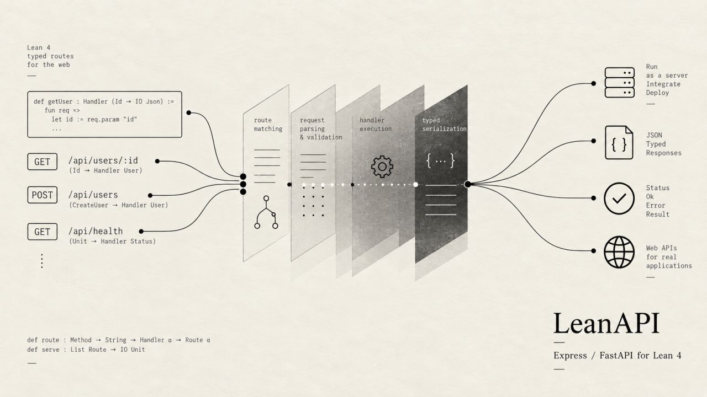

# LeanAPI: An API server for Lean 4

Introducing LeanAPI v0.1, an api server for your applications written in Lean 4. Think of it as Express/FastAPI equivalent. Includes all the usual stuff, routing, middlewares, auth and headers.

Enjoy!

GitHub: <https://github.com/theoriclabs/leanapi>
