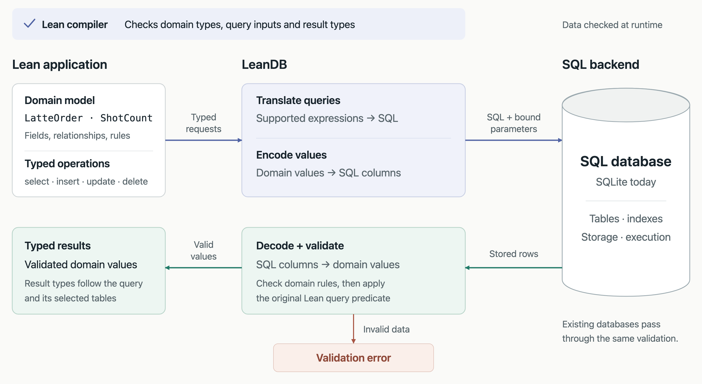

# LeanDB: A strongly typed SQL Frontend

At Theoric Labs we believe AgenticAI combined with Formal methods can “solve” software. Essentially, we belive software will be fast, and [bug free](https://theoric.com/blog/the-future-of-software-will-be-bug-free/).

LeanDB is an experiment in applying part of this idea to databases: describe our data and its properties in Lean, while using SQL databases for storage and querying.


## A Primer on Types in Lean

Types are powerful because they allow us to check properties before the code is run. A function expecting a number should not accidentally receive a string.

Lean takes this much further. We can express properties as propositions, construct proofs of those properties, and have Lean check those proofs. Expressing a property does not mean Lean will automatically prove it, but it gives us a precise statement of what needs to be established.

Let’s use a café menu as an example. We want to describe the products we sell, their available configurations, and the rules which make an order valid.

The following examples illustrate the modeling approach, rather than the current feature set of the LeanDB prototype.

## Inductive Types

An inductive type describes the ways a value can be constructed. Different cases can contain different information, and a case can contain more values of the same type.

For our café, we can start with the available temperatures and milks:

```lean
inductive Temperature where
  | hot
  | iced

inductive Milk where
  | dairy
  | oat
  | almond
```

We can then describe our menu:

```lean
inductive MenuItem where
  | latte (temperature : Temperature) (milk : Milk)
  | pastry (name : String)
  | bundle (items : List MenuItem)
```

A latte has a temperature and a milk choice. A pastry has a name. A bundle contains other menu items:

```lean
def breakfast : MenuItem :=
  .bundle [
    .latte .hot .oat,
    .pastry "Croissant"
  ]
```

We don’t need to represent everything as one record with a collection of optional fields. A pastry does not have an irrelevant `milk` field, and a latte cannot be constructed without a milk choice.

The `bundle` case also makes this recursive: a bundle can contain individual items or other bundles. We have described a whole family of possible menu items using a small set of construction rules.

## Refinement Types

Sometimes an ordinary type allows more values than our application should accept.

Suppose our café allows between one and four espresso shots in a latte. A natural number is not enough to describe this: it also allows zero, five, or a million.

We can refine it:

```lean
abbrev ShotCount :=
  { n : Nat // 0 < n ∧ n ≤ 4 }
```

This means: a natural number `n`, together with a proof that it is greater than zero and at most four. Lean represents this using a *subtype*.

A double shot is valid:

```lean
def doubleShot : ShotCount :=
  ⟨2, by decide⟩
```

The `2` is the value. The `by decide` supplies a proof of the simple arithmetic condition.

These attempted definitions would be rejected:

```lean
-- Rejected: zero does not satisfy the condition.
-- def noShots : ShotCount := ⟨0, by decide⟩

-- Rejected: five does not satisfy the condition.
-- def fiveShots : ShotCount := ⟨5, by decide⟩
```

Now a function accepting a `ShotCount` receives not just a number, but a number whose range has been established.

What about a number coming from a user at runtime? We still have to check it:

```lean
def parseShotCount (n : Nat) : Option ShotCount :=
  if h : 0 < n ∧ n ≤ 4 then
    some ⟨n, h⟩
  else
    none
```

The successful branch has evidence that the condition holds, so it can construct a `ShotCount`. The unsuccessful branch returns `none`. This is the same general approach used when decoding external data into types with stronger guarantees.

The point is not to eliminate all runtime validation. It is to make the result of validation explicit, so the rest of the application can use it.

## Dependent Types

Sometimes whether one choice is valid depends on another choice.

Suppose our café serves hot lattes in small, medium, and large cups, but iced lattes only in medium and large cups.

We could represent temperature and size as two independent fields and check their combination later. Instead, we can make the type of the size depend on the temperature:

```lean
inductive CupSize : Temperature → Type where
  | small : CupSize .hot
  | medium : {t : Temperature} → CupSize t
  | large : {t : Temperature} → CupSize t
```

Here, `CupSize .hot` and `CupSize .iced` are related but different types. The `small` constructor is only available for the hot version. This is an example of an *indexed family*: the index determines which constructions are available.

We can use this in an order:

```lean
structure LatteOrder where
  temperature : Temperature
  size : CupSize temperature
  milk : Milk
  shots : ShotCount
```

Notice the field:

```lean
size : CupSize temperature
```

The type of `size` depends on the **value** of `temperature`.

An iced oat latte with two shots is valid:

```lean
def icedOatLatte : LatteOrder :=
  { temperature := .iced
    size := .large
    milk := .oat
    shots := doubleShot }
```

But there is no small iced size in this model:

```lean
-- Rejected: .small has type CupSize .hot,
-- not CupSize .iced.
-- def smallIced : CupSize .iced := .small
```

We have now combined several ideas. The milk must be one of the choices we defined. The number of shots must satisfy a range constraint. The available cup sizes depend on the temperature.

These are not just comments describing what a valid order should look like. They are part of the type of the order.

## Meta Types: Data That Describes a Type

So far, we have written our menu choices directly in Lean. But what happens when the café wants to define new choices as data?

Perhaps one product has a milk selector, another has a gift-wrap toggle, and another has a field for a message.

Lean allows functions to return types. We can use this to define a small language of field descriptions, then interpret those descriptions into actual Lean types. This is commonly called the *universe design pattern*.

```lean
inductive FieldSpec where
  | text
  | toggle
  | choice (options : List String)
```

A field can contain text, a Boolean choice, or one of a specified list of strings.

Now we define what a value of each field looks like:

```lean
def FieldSpec.Value : FieldSpec → Type
  | .text => String
  | .toggle => Bool
  | .choice options =>
      { value : String // value ∈ options }
```

The important thing here is that `FieldSpec.Value` returns a **type**, not a string describing a type.

For a milk selector:

```lean
def milkField : FieldSpec :=
  .choice ["Dairy", "Oat", "Almond"]

def selectedMilk : FieldSpec.Value milkField :=
  ⟨"Oat", by decide⟩
```

The allowed choices are now represented as ordinary data. That data determines the type of a valid selection.

A different list of choices gives us a different restriction:

```lean
def syrupField : FieldSpec :=
  .choice ["Vanilla", "Caramel"]

def selectedSyrup : FieldSpec.Value syrupField :=
  ⟨"Vanilla", by decide⟩
```

This is what I mean here by “meta types”: **data which describes a type**.

A larger version could describe a whole product configuration, with several fields and rules relating them. The product definition would describe what can be configured, and an interpretation function would determine the type of a valid configuration.

The examples above use definitions known when the code is checked. A specification loaded from a database would still need to be decoded at runtime, and a submitted value checked against that specification. Dependent types let us preserve the relationship between the specification and the accepted value; they do not make future database contents known at compile time.

## Why do we need a strongly typed database?

### If you accidentally try to push bad data, the compiler will prevent you from doing so.

Wrong type in a column:

```lean
def bob : Row users := .cons "bob" (.cons "bob@example.com" (.cons true .nil))  -- does not compile
```

```
error: Application type mismatch: The argument
  "bob"
has type
  String
but is expected to have type
  Ty.int.denote
```

Missing column:

```lean
def carol : Row users := .cons 3 (.cons "carol@example.com" .nil)  -- does not compile
```

```
error: Application type mismatch: The argument
  Row.nil
has type
  Row []
but is expected to have type
  Row [("active", Ty.bool)]
```

Look at that second error. The compiler is telling you exactly which column you forgot.

### If you accidentally miss a validation, your compiler tells you.

Say withdrawing from an account requires that the account has enough balance. Put that requirement into the function's type.

```lean
structure Account where
  id      : Nat
  balance : Nat

def withdraw (a : Account) (amt : Nat) (_ : amt ≤ a.balance) : Account :=
  { a with balance := a.balance - amt }
```

The third argument is a proof. You cannot call `withdraw` without one.

```lean
def overdraw (a : Account) : Account := withdraw a 1000000  -- does not compile
```

```
error: Type mismatch
  withdraw a 1000000
has type
  1000000 ≤ a.balance → Account
but is expected to have type
  Account
```

The only way to get the proof is to do the check.

```lean
def safeWithdraw (a : Account) (amt : Nat) : Option Account :=
  if h : amt ≤ a.balance then some (withdraw a amt h) else none
```

So the validation is not a thing you remember to do. It is a thing the compiler will not let you forget. This is the exact class of bug that agents introduce: the code works, the tests pass, and the check that used to be there is gone. Here, the check cannot be gone.

### More important, and interesting: typed databases let you express queries which are just super hard to express otherwise.

Column access, checked at compile time. First we need a way to say "column `n` with type `t` exists in schema `s`". That is itself a type.

```lean
inductive HasCol : Schema → String → Ty → Type where
  | here  {s : Schema} {n : String} {t : Ty} : HasCol ((n, t) :: s) n t
  | there {s : Schema} {n n' : String} {t t' : Ty} : HasCol s n t → HasCol ((n', t') :: s) n t
```

Then a lookup that takes the row and the proof that the column is there.

```lean
def Row.get {s : Schema} {n : String} {t : Ty} : Row s → HasCol s n t → t.denote
  | .cons v _, .here    => v
  | .cons _ r, .there h => r.get h

def Row.col {s : Schema} (r : Row s) (n : String) {t : Ty}
    (h : HasCol s n t := by repeat constructor) : t.denote :=
  r.get h
```

That `by repeat constructor` is the compiler searching the schema for the column at compile time. You just write the column name.

```lean
#eval alice.col "email"    -- "alice@example.com"
#eval alice.col "active"   -- true
```

Notice the return types. `alice.col "email"` is a `String`. `alice.col "active"` is a `Bool`. Not a `Value`, not an `Any`, not a string you cast later. The type of the result depends on which column you asked for.

And a typo:

```lean
#eval alice.col "emial"  -- does not compile
```

```
error: unsolved goals
⊢ HasCol [] "emial" ?m.3
```

The compiler walked the whole schema, ran out of columns, and stopped you. Your SQL database would have told you at 3am.

Now joins. The result schema of a join is computed from the input schemas. In the type.

```lean
def Row.append {a b : Schema} : Row a → Row b → Row (a ++ b)
  | .nil,      r => r
  | .cons v l, r => .cons v (l.append r)

abbrev orders : Schema := [("order_id", .int), ("total", .int)]

def joined : Row (users ++ orders) :=
  alice.append (.cons 17 (.cons 4200 .nil))

#eval joined.col "total"   -- 4200
```

`Row (users ++ orders)` is a type that was computed by concatenating two lists. You never wrote the joined schema down. The compiler derived it, and `joined.col "total"` type-checks against the derived schema.

Try doing that in an ORM.

## Architecture and Design Philosophy

Lean has an extremely expressive type system. We want to describe the shape of our data in Lean, and use a SQL database as its physical store, for efficient storage and querying.

For the café, the domain model should be able to say more than:

> An order has a temperature column, a size column, and a shots column.

It should be able to say:

> An order has a temperature, a size valid for that temperature, and a shot count between one and four.

We want the application to work with the second description, even when the underlying storage uses ordinary database columns.

## Typed Queries

We also want to preserve and extend the general shape of SQL queries: `select`, `insert`, `update`, and `delete`.

The idea is that queries are typed in Lean and automatically converted to SQL for execution.

For example, consider a menu table with a name, a price in cents, and an availability flag. A query selecting only names should return strings. A query selecting names and prices should return pairs of names and prices. The result type should follow from the query, rather than being separately declared and kept in sync by hand.

Similarly, referring to a nonexistent field or supplying a string where a numeric value is required should be rejected when constructing the typed query.

This needs a defined query language that LeanDB knows how to translate. The goal is not to assume that any arbitrary Lean function can automatically become SQL.

## Preserving the Domain Model

For writes, we want to accept values which satisfy the domain’s requirements.

For reads, we need to reconstruct those values from the stored representation. A row containing an iced latte with a small cup must not silently become a valid `LatteOrder`.

For example, the shot count stored in a row might be an ordinary integer. Reading that row should include the necessary decoding and validation before producing a `ShotCount`.

The same applies to existing databases. We want compatibility so that you can bring your existing SQL database into LeanDB, but existing data must be checked against any stronger properties we introduce.

This also gives us a concrete distinction between describing the model and implementing the database layer. Defining `LatteOrder` in Lean does not, by itself, establish that its SQL encoding, decoding, and queries preserve its meaning. That is part of the work LeanDB needs to do.

## Architecture Diagram



## Results and Next Steps

The first thing I wanted to see was whether we could actually have even a working prototype of LeanDB. It seems to be the case.

I would like you to try out [leanDB](https://github.com/theoriclabs/leandb).

One thing I want to try from here is using Lean to write frontend and backend applications. This would allow the domain types defined in Lean to be used across the application.
